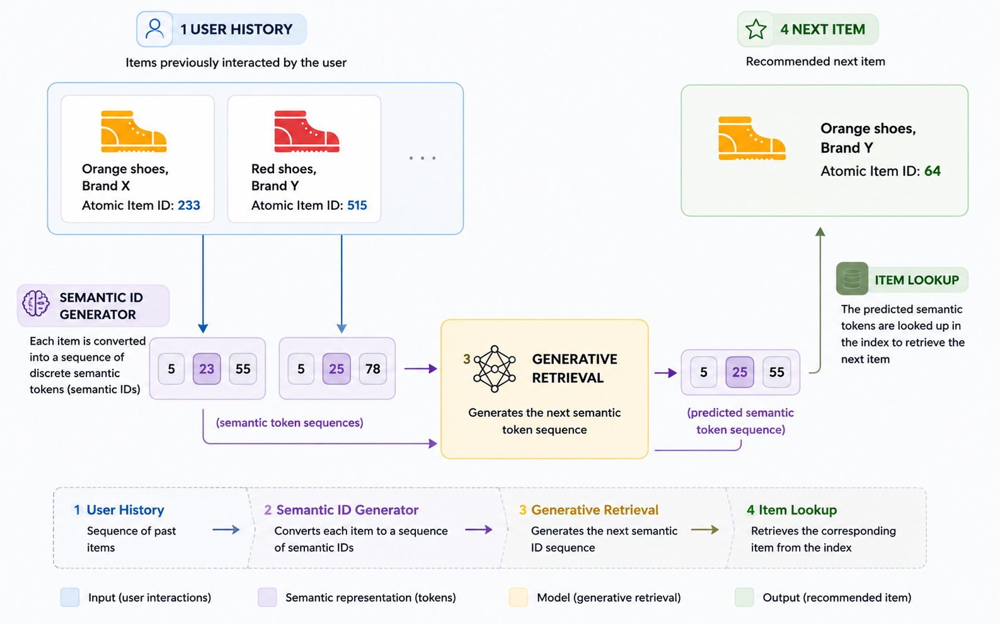
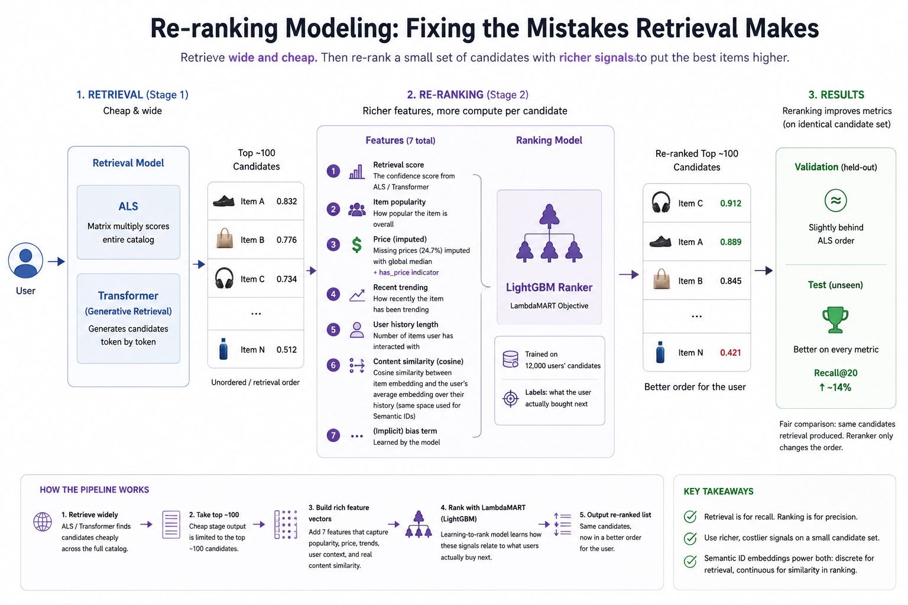
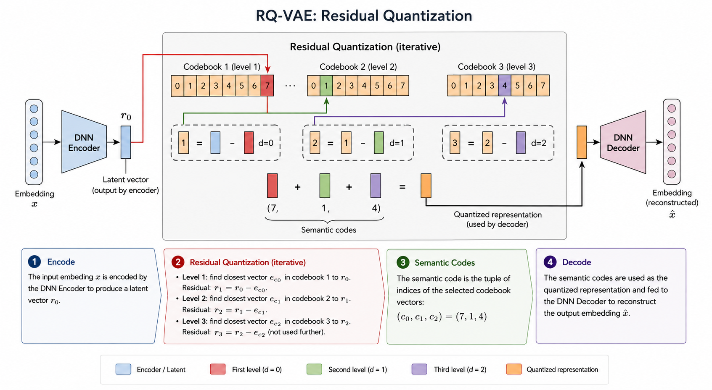
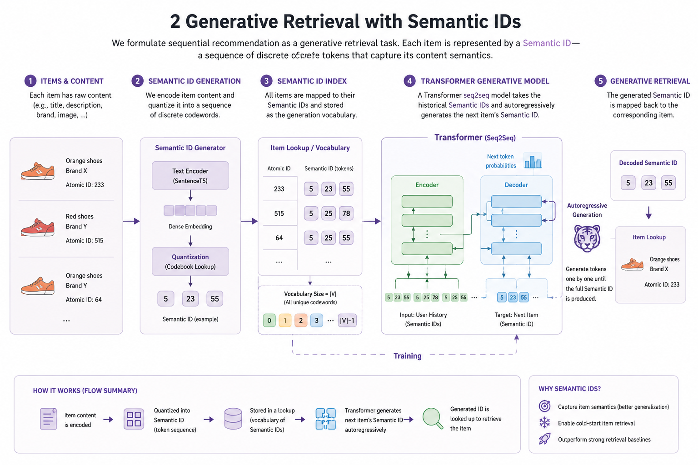
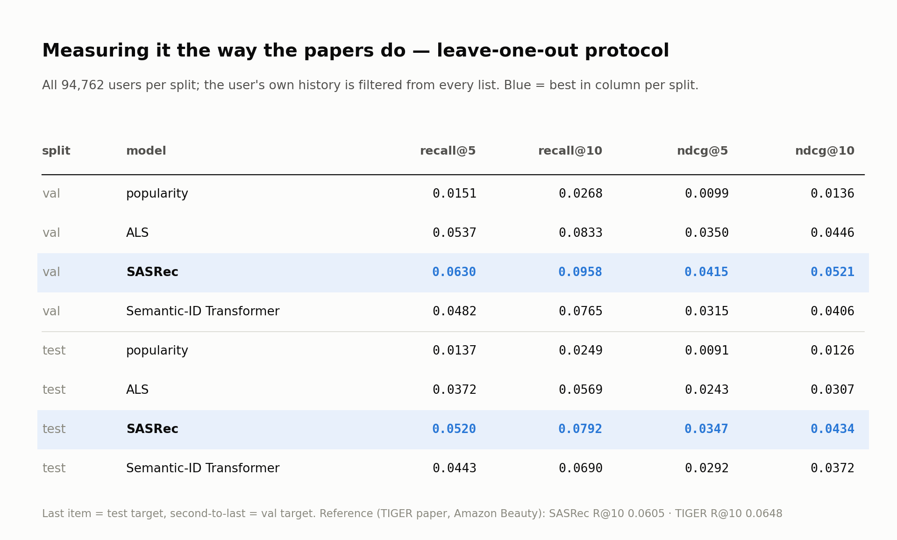
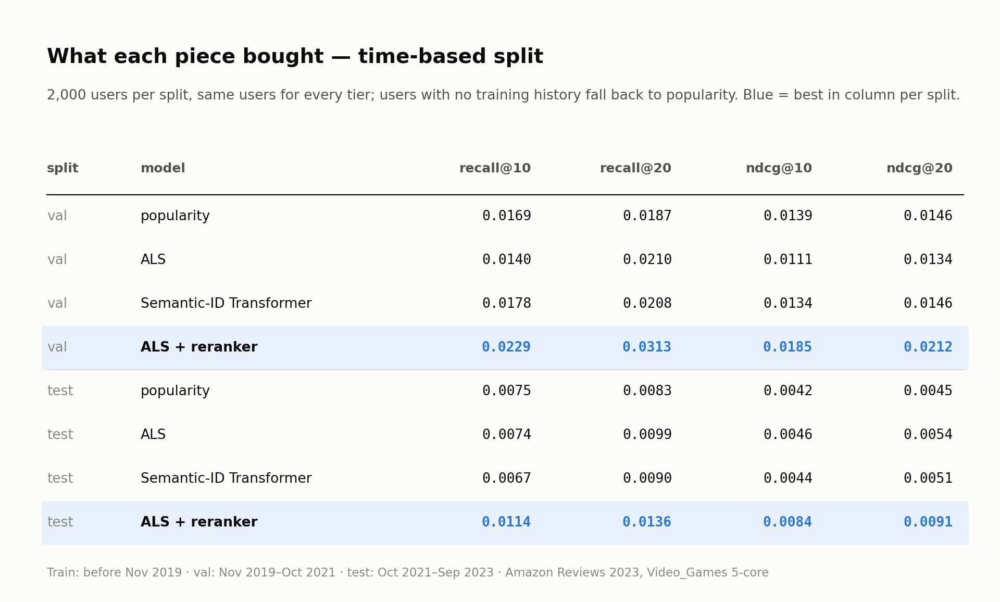
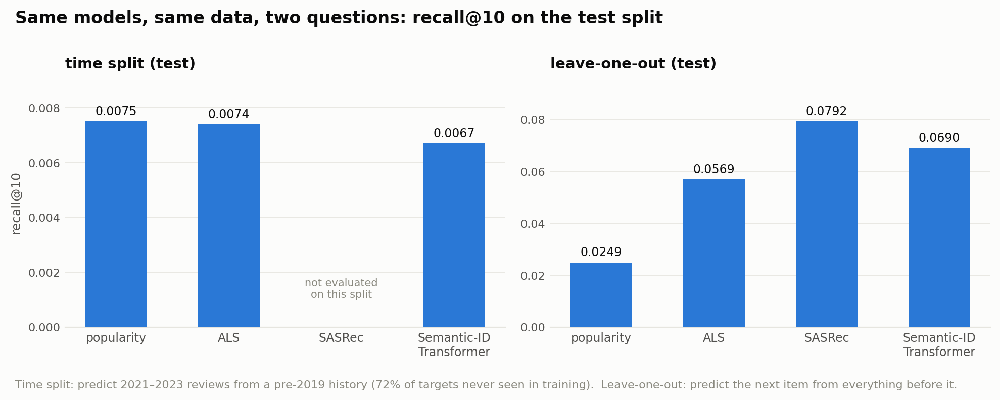
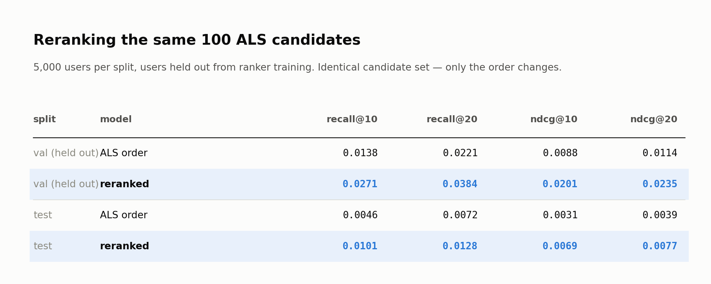

# Generative Recommendations, Built From Scratch

A two-stage recommender on real Amazon data — **Semantic IDs + a Transformer that *writes* the
next item** (the approach behind TIGER / Google, HSTU / Meta) with a **learned reranker** on
top — measured against the classic baselines it is supposed to beat, under two evaluation
protocols, with every bug found along the way documented.

Companion to the blog post *Generative AI for Recommendations: What YouTube, Netflix and
Meta Are Moving To, Built From Scratch*. Each section of the post has a runnable Colab
notebook (below).



## Run it yourself — one Colab notebook per section

No setup: each notebook clones this repo, downloads the pre-computed artifacts from the
[`v1.0-artifacts` release](https://github.com/juanmigutierrez/generative-recommendation-engine/releases/tag/v1.0-artifacts)
and runs an interactive, small version of one stage in well under ten minutes on a free
runtime. They use the project's own code in `backend/`, not a re-implementation, and carry
the post's math and figures inline.

| # | What you do in it | GPU | |
|---|---|---|---|
| 1 | **Data & baselines** — read a real user's history, see why the split is by time, play with Recall@K / NDCG@K on toy lists, fit popularity and ALS and compare their top-10 for any user against what they bought next | no | [](https://colab.research.google.com/github/juanmigutierrez/generative-recommendation-engine/blob/main/notebooks/tutorial_01_data_and_baselines.ipynb) |
| 2 | **Semantic IDs** — type any product title and get its Sentence-T5 neighbours, see the anisotropy trap, **train the RQ-VAE** and browse the "families" its first digit discovers | recommended | [](https://colab.research.google.com/github/juanmigutierrez/generative-recommendation-engine/blob/main/notebooks/tutorial_02_semantic_ids.ipynb) |
| 3 | **Generative retrieval** — turn a history into tokens, train a small Transformer (or load the trained one), run constrained beam search digit by digit and watch it pick a family before an item | yes | [](https://colab.research.google.com/github/juanmigutierrez/generative-recommendation-engine/blob/main/notebooks/tutorial_03_generative_retrieval.ipynb) |
| 4 | **Ranking** — build the seven features, train the LambdaMART reranker twice (with the bug that made the first version learn the opposite of what it should, and fixed), probe what each learned, inspect "position 98 → 1" cases | no | [](https://colab.research.google.com/github/juanmigutierrez/generative-recommendation-engine/blob/main/notebooks/tutorial_04_ranking.ipynb) |
| 5 | **Evaluation** — one user under both protocols, four models' lists side by side, and the leave-one-out table with SASRec reproduced on a sample | yes | [](https://colab.research.google.com/github/juanmigutierrez/generative-recommendation-engine/blob/main/notebooks/tutorial_05_evaluation.ipynb) |

The notebooks are generated from `notebooks/_build_tutorials.py`; see `notebooks/README.md`.

## The architecture in one picture

Real recommenders don't use one model. **Retrieval** narrows 25,612 items down to ~100
candidates per user cheaply; **ranking** spends more compute per candidate to order them.



| Stage | Model | What it is | Code |
|---|---|---|---|
| baseline | Popularity | count, sort, remove what the user has | `backend/models/popularity.py` |
| baseline | ALS | implicit-feedback matrix factorisation (Hu, Koren & Volinsky 2008) | `backend/models/als.py` |
| baseline | **SASRec** | causal Transformer over raw item IDs — the control the papers compare against | `backend/models/sasrec.py` |
| retrieval | **Semantic IDs** | Sentence-T5 title embedding → RQ-VAE → 3 digits + tie-break | `backend/models/rqvae.py` |
| retrieval | **Generative Transformer** | decoder-only Transformer that writes the next Semantic ID, constrained beam search over a trie of real items | `backend/models/transformer.py`, `backend/scripts/evaluate_retrieval.py` |
| ranking | LightGBM LambdaMART | 7 features per candidate (retrieval score, popularity, price, recency, content similarity, history length) | `backend/models/ranking_features.py`, `backend/scripts/train_ranker.py` |

Every layer is hand-written in JAX (the RQ-VAE, the Transformer, beam search) so each piece
can be pointed at and explained; only ALS (`implicit`) and the ranker (`lightgbm`) are
library calls.

### How an item becomes a Semantic ID



The title goes through `sentence-t5-base` (768 numbers), a small encoder compresses it to
32, and three codebooks of 256 vectors quantise it level by level on the residual. Items
with similar titles share a first digit — five items on one code turned out to be five
gaming keyboards and mice, a grouping nobody labelled. 25,612 items → 21,713 unique 3-digit
codes; the rest get a 4th tie-break digit. Details and the pitfalls (anisotropy, codebook
collapse, k-means init) in `docs/05_semantic_ids.md`.

### How the next item is generated



A user's history becomes a stream of digits (plus a user token); a Transformer is trained
to predict the next digit like a language model predicts the next word. At inference it
writes four digits, constrained at each step to prefixes that lead to a real catalog item,
with beam search keeping the best partial IDs alive. Details in `docs/06_generative_retrieval.md`.

## Results

### Under the papers' protocol (leave-one-out, all 94,762 users)

Last item = test target, second-to-last = val target, context = everything before.



The generative model reaches Recall@10 of 0.077 / 0.069 (val / test) — ~3x the popularity
floor and in the range TIGER reports on its own datasets (0.065 on Amazon Beauty). SASRec,
the ID-based Transformer with the same backbone, is still ~15% ahead on this dataset; the
suspects (training budget, 28% first-level codebook utilisation, decoder-only vs
encoder-decoder, the heavy head of Video Games) are listed in `docs/10_loo_protocol.md`.

### Under a production-style time split (train < Nov 2019, test = Oct 2021 – Sep 2023)



Here the numbers are 10x smaller and every retrieval tier sits on the same floor: 72% of
test items never appear in training and the median gap between a user's last training
review and their first test review is 1,397 days. The reranker is the clear winner
(+35–50% over the best retrieval tier). Same models, different question:



### The bug worth reading about

The first reranker trained on candidate lists with the true item *injected* when retrieval
had missed it — 93% of its positives — and learned that "the lowest-scored, never-seen
candidate is the positive". Sensible feature importances, plausible scores, inverted
behaviour. Reproduced and fixed in Tutorial 4; full story in
`docs/09_audit_sources_and_results.md`. After the fix, reranking doubles ALS on held-out users:



## Dataset

[Amazon Reviews 2023](https://amazon-reviews-2023.github.io/) (McAuley Lab, UCSD), the
**5-core `Video_Games`** subset: 94,762 users, 25,612 items, 814,586 interactions, real
product titles, timestamps 1999–2023. Why this one (and why the raw reviews and a UCI retail
placeholder were tried first and rejected) is in `docs/01_dataset.md`. Note that being on a
benchmark dataset does not make numbers comparable to the papers by itself — the protocol
has to match too, which is why there are two evaluation tracks (`docs/02_split_and_eval.md`,
`docs/10_loo_protocol.md`).

## Reproducing the full pipeline locally

```bash
pip install -r requirements.txt

# data
python backend/scripts/download_amazon_reviews.py
python backend/scripts/prepare_data_amazon.py
python backend/scripts/split_data.py                      # time split
python backend/scripts/build_sequences.py
python backend/scripts/split_data_loo.py                  # leave-one-out split (paper protocol)

# baselines
python backend/scripts/run_baselines.py

# semantic ids  (item embeddings: build_item_embeddings_local.py, needs a GPU or patience)
python backend/scripts/train_rqvae.py

# generative retrieval, paper-protocol track (GPU recommended; resumable, one checkpoint per run)
python backend/scripts/build_semantic_sequences.py --loo --max-items 20 --user-buckets 2000
python backend/scripts/train_transformer.py --loo --epochs 40 --d-model 128 --layers 4 --d-ff 512 --dropout 0.1
python backend/scripts/train_sasrec.py --epochs 30

# ranking
python backend/scripts/train_ranker.py
python backend/scripts/evaluate_ranking.py

# the two result tables
python backend/scripts/run_full_evaluation.py --split both              # time split
python backend/scripts/run_loo_evaluation.py --split both --n-users 0   # leave-one-out
```

`notebooks/colab_loo_training.ipynb` runs the GPU training steps on Colab.
`backend/scripts/make_release_bundle.py` + `create_release.py` package the artifacts the
tutorial notebooks download.

## Project structure

```
backend/
  models/       popularity, als, sasrec, rqvae, transformer, ranking_features, metrics
  scripts/      one script per pipeline step (data → split → train → evaluate)
  app/          FastAPI serving layer
notebooks/      tutorial_01..05 (Colab tutorials), colab_loo_training, original build logs
docs/           one document per step: what, why, what was measured, what went wrong
blog/           post draft, paste-ready edits, result images
data/           raw + processed (git-ignored; see the release)
```

## Docs, in reading order

| doc | content |
|---|---|
| `docs/00_roadmap.md` | the plan |
| `docs/01_dataset.md` | dataset choice, three attempts |
| `docs/02_split_and_eval.md` | time-based split, cold-start counts, metrics |
| `docs/05_semantic_ids.md` | Sentence-T5 → RQ-VAE, collapse and the fix |
| `docs/06_generative_retrieval.md` | Transformer, trie-constrained beam search |
| `docs/07_ranking.md` | features, LambdaMART |
| `docs/08_evaluation.md` | unified time-split table (with the post-fix re-run) |
| `docs/09_audit_sources_and_results.md` | source-by-source audit: what the code really implements vs. the papers, and the bugs found |
| `docs/10_loo_protocol.md` | leave-one-out track, SASRec, full results and what to try next |

## Sources

Rajput et al. 2023, *Recommender Systems with Generative Retrieval* (TIGER) —
[arXiv:2305.05065](https://arxiv.org/abs/2305.05065) ·


Zhai et al. 2024, *Actions Speak Louder than Words* (HSTU) —
[arXiv:2402.17152](https://arxiv.org/abs/2402.17152) (framing; not implemented here) ·

Kang & McAuley 2018, *SASRec* — [arXiv:1808.09781](https://arxiv.org/abs/1808.09781) ·


van den Oord et al. 2017, *VQ-VAE* — [arXiv:1711.00937](https://arxiv.org/abs/1711.00937) ·


Vaswani et al. 2017 — [arXiv:1706.03762](https://arxiv.org/abs/1706.03762) ·


Ni et al. 2021, *Sentence-T5* — [arXiv:2108.08877](https://arxiv.org/abs/2108.08877) ·
Hu, Koren & Volinsky 2008, *Collaborative Filtering for Implicit Feedback Datasets* ·
Ke et al. 2017, *LightGBM* (NeurIPS) ·
Hou et al. 2024, *Amazon Reviews 2023*.
