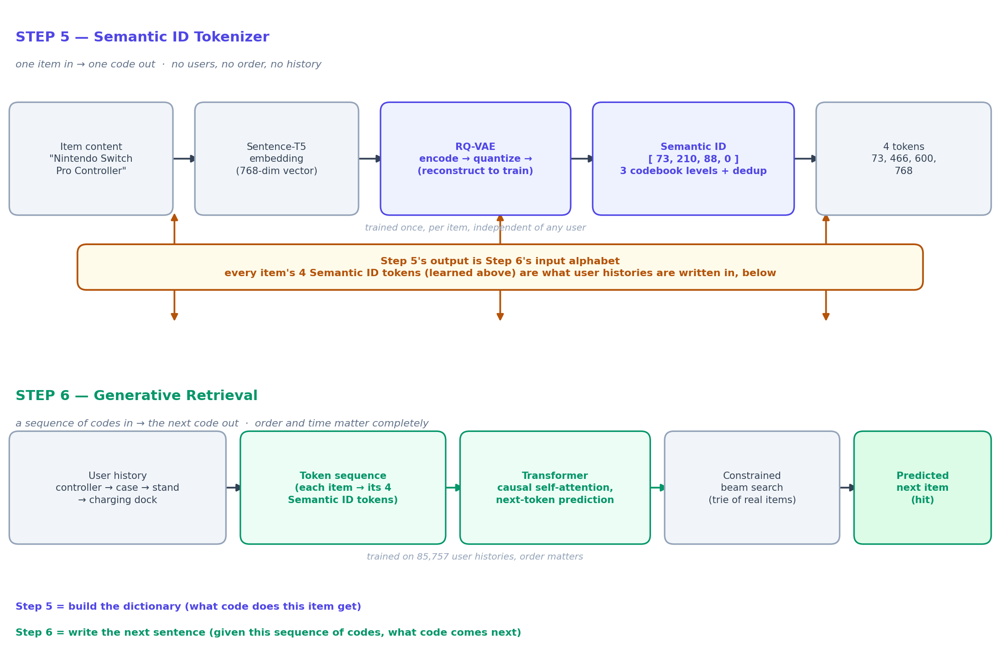
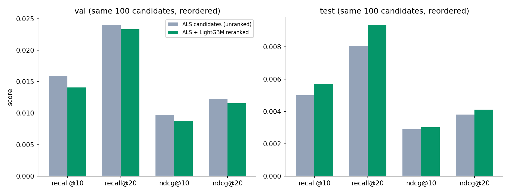

# Generative AI for Recommendations: What YouTube, Netflix and Meta Are Moving To, Built From Scratch

*A build log: a generative recommender (Semantic IDs + Transformer retrieval, then ranking)
built end to end on real Amazon data — data pipeline, models, API, and a live demo — with
every design decision explained, not just the code.*

> Status: draft, in progress. This post is being written alongside the build itself, so
> it includes the false starts, not just the parts that worked on the first try.

---

A recommendation system is the part of an app that decides what to show you next: which
products, which videos, which songs. Think of Amazon's "customers who bought this also
bought", Netflix's homepage, Spotify's Discover Weekly.

The problem is simple to state: there are too many items for anyone to browse, so
something has to decide what's worth showing each person. Get it right and people find
things they actually want. Get it wrong and it's just noise.

The classic idea is intuitive: if two people liked similar things in the past, they'll
probably like similar things in the future. The algorithm's job is to figure out,
mathematically, who is similar to whom and what is similar to what, without anyone
defining "similar".

This works well until something new shows up. A new user has no history, and a new
product has no buyers, so the model has nothing to compare. In the dataset I used, up to
28% of test users had never been seen during training.

That's where a generative recommender comes in. Instead of scoring items by similarity,
it treats your history like a sentence and *generates* the next item, the way a language
model generates the next word. And because each item's "word" is built from its content
(its title and description), a brand-new product can be recommended before anyone has
bought it. This isn't a research curiosity:
[YouTube](https://tullie.ai/blog/youtube-semantic-ids-ctr-lift),
[Netflix](https://netflixtechblog.com/genrec-towards-llm-native-recommendation-at-netflix-f20be6f643e3)
and [Meta](https://github.com/meta-recsys/generative-recommenders) have all published how
they're moving their recommendations in this direction.

In this post I'll build a generative AI recommender from scratch, on real Amazon data, and
measure what each piece actually adds over the classic approach.

## Why this project

Most recommender-system portfolio projects are a single collaborative-filtering notebook
on MovieLens. That's fine as an exercise, but it doesn't look like what recommendation
systems actually are at companies running them in production: a multi-stage pipeline
where cheap, wide *retrieval* narrows a huge catalog down to a shortlist, and a more
expensive, precise *ranking* model orders that shortlist.

This project builds that pattern for real, on a real e-commerce dataset, using the same
family of techniques (generative retrieval over "Semantic IDs") that Google DeepMind's
TIGER and Meta's HSTU/"Actions Speak Louder Than Words" papers introduced — not because
it's trendy, but because it's genuinely the direction the field has moved, and building it
first-hand is a much better way to be able to talk about it than reading the papers alone.

## The architecture, at a glance

```
                    ┌──────────────┐        ┌──────────┐
user history  ───▶  │  RETRIEVAL   │ ───▶   │ RANKING  │ ───▶  top-K recommendations
                    │ (cheap, wide) │ 100s   │(precise, │
                    └──────────────┘ candid. │ narrow)  │
                                              └──────────┘
```

- **Baselines** (popularity, ALS matrix factorization) — establish the floor.
- **Retrieval**: item content → RQ-VAE → discrete "Semantic IDs" → a Transformer trained to
  *generate* the next item's Semantic ID from a user's history, autoregressively.
- **Ranking**: a second model reorders retrieval's candidates using features retrieval
  couldn't afford to compute for the whole catalog (price, recency, popularity, content
  similarity).
- Every stage gets measured with Recall@K / NDCG@K against the same held-out data, so the
  post can show *what each added layer of complexity actually bought*, not just assert it.

Full architecture references: TIGER ([arXiv](https://arxiv.org/abs/2305.05065)), HSTU /
generative recommenders ([Meta, GitHub](https://github.com/facebookresearch/generative-recommenders)).

## Picking a dataset was harder than the model

This is worth writing up honestly, because it's a more realistic engineering story than
"I downloaded MovieLens and got 95% accuracy."

**Attempt 1 — Amazon Reviews 2023.** The obvious choice: real e-commerce interactions,
the same dataset family the TIGER-style papers benchmark on. Blocked immediately — the
environment this was first being built in had no network access to Hugging Face, where the
dataset lives.

**Attempt 2 — UCI Online Retail**, as a placeholder to keep the pipeline moving: real
transaction data from a UK gift retailer, ~540K rows, reachable via a GitHub mirror. Good
enough to build and test the whole cleaning → splitting → sequence-building pipeline
against real data while the Amazon path got sorted out.

**Attempt 3 — Amazon Reviews 2023, raw `All_Beauty` category.** Once reachable directly
(downloading straight from the dataset's own file server instead of through a library),
this looked like the win — until the numbers came in: **93.9% of users had exactly one
review, ever.** A sequential recommender needs *history* to predict from. With almost no
repeat users, there's nothing to learn. Not a bug — just what raw review data looks like:
most people review a product once and move on.

**Attempt 4 (final) — Amazon Reviews 2023, "5-core" `Video_Games`.** The dataset's authors
publish a pre-filtered version specifically for recsys benchmarking: every user and item
guaranteed ≥5 interactions, by construction. `Video_Games` was chosen over the default
`All_Beauty` because `All_Beauty` collapses to only 253 users after that filtering — too
small. `Video_Games` gives **94,762 users, 25,612 items, 814,586 interactions** — a real,
commonly-benchmarked category. (A caveat learned later: being on a benchmark dataset does
not make results comparable to published numbers by itself — the *evaluation protocol* has
to match too, and this project's time-based split deliberately doesn't. The section on the
leave-one-out track below is what actually closes that gap.)

*Blog framing note: this makes a good section because it shows judgment, not just
execution — "here's the number that told me to change course," three times, is more
convincing than a project where every choice was right the first time.*

## Splitting data the way production systems actually need to

A random train/test split lets a model train on a 2022 interaction and get evaluated on
one from 2005 — it's effectively seen the future. Every real recommender predicts
*forward* in time from what it currently knows, so evaluation has to mirror that.

The split here is **time-based**, and — a small engineering detail worth mentioning —
computed as a *percentage of the dataset's own timespan* rather than hardcoded dates, so
the same script produces a sensible split whether the data spans one year (UCI) or
twenty-four (Amazon). Last 8% of the time range → test, the 8% before that → val, everything
earlier → train.

| Split | Rows | Users |
|---|---|---|
| Train | 645,982 | 85,757 |
| Val | 96,009 | 32,852 |
| Test | 72,595 | 22,722 |

And a number that matters a lot for the rest of the architecture: **18–28% of val/test
users are "cold-start"** — never seen in training at all. A pure collaborative-filtering
model has *zero* signal for them; it can only fall back to popularity. That gap is the
direct, measured justification for the content-based Semantic ID retrieval stage later in
this series — it's not a nice-to-have, it's fixing a specific, quantified failure mode.

## Baselines: earning the right to add complexity

Before anything sophisticated, two simple models, to establish the floor:

**Popularity** — recommend whatever's most-interacted-with, same list for everyone. Sounds
too dumb to bother with, but with a median of 6 interactions per user, it's a genuinely
strong baseline in practice.

**ALS (matrix factorization)** — represent every user and item as a short vector such that
`dot(user_vector, item_vector)` ≈ affinity. The vectors aren't hand-designed; they're
learned purely from interaction patterns. The "alternating" in ALS is the trick that makes
training tractable: solving for all users *and* items simultaneously is hard and
non-convex, but freezing one side and solving the other is plain least squares — so the
algorithm alternates, freeze-solve-swap, until it converges.

One implementation detail worth a paragraph in the technical write-up: this data is
*implicit feedback* — we only observe positive interactions, never a true "dislikes this."
The standard fix (Hu, Koren & Volinsky, 2008) is confidence weighting: treat every observed
interaction as a positive with confidence proportional to interaction strength, rather than
treating every unobserved pair as a certain negative.

| split | model | recall@10 | recall@20 | ndcg@10 | ndcg@20 |
|---|---|---|---|---|---|
| val | popularity | 0.0146 | 0.0180 | 0.0111 | 0.0122 |
| val | als | 0.0149 | 0.0227 | 0.0107 | 0.0132 |
| test | popularity | 0.0058 | 0.0071 | 0.0038 | 0.0042 |
| test | als | 0.0051 | 0.0078 | 0.0036 | 0.0044 |


**ALS doesn't cleanly win.** It's ahead on recall@20 in both splits, roughly tied on
recall@10, and actually a little behind popularity on test recall@10 and both ndcg@10
numbers. That's not a bug — it's a real, honest result, and it comes down to two things
already measured above: a median of 6 interactions per user gives ALS very little signal to
personalize with, and 18–28% of val/test users are cold-start, where ALS has no learned
vector at all and just falls back to popularity anyway. So a chunk of "ALS's" score here is
really popularity's score in disguise.

That gap is exactly the motivation for the next step: Semantic IDs and generative retrieval
are built specifically to still say something useful about sparse and cold-start
users — which is precisely where this baseline comparison shows plain collaborative
filtering running out of signal.

## Retrieval, part 1: giving every item a meaningful ID

That gap — ALS having nothing to say about a fifth of users — is a fixable problem, but not
by tweaking ALS. The fix has to come from somewhere ALS never looks: what an item actually
*is*, not just who bought it.

Right now every item in this dataset has an arbitrary integer ID. Item #4821 carries no
information — a phone case and a gaming keyboard could sit one number apart. What TIGER
(Google DeepMind, NeurIPS 2023) proposes instead: give every item a short code *derived
from its content*, so similar items land on similar codes, and a brand-new item gets a
valid, meaningful code the moment it's added to the catalog — before a single person has
ever interacted with it. That's the direct fix for cold-start, and it's also the piece
retrieval needs next: a discrete vocabulary a model can generate from, the same way a
language model generates words.

### What's an RQ-VAE?

The mechanism that produces these codes is a Residual-Quantized VAE. Take an item's
content embedding (a 768-dim vector from a pretrained sentence model, capturing what the
title means, not just its words), pass it through a small encoder network, and instead of
keeping that compressed vector continuous, snap it to the nearest vector in a small learned
"codebook" — a fixed table of a few hundred reference points. That snap is what makes the
representation discrete and tokenizable.

One codebook alone is coarse. So RQ-VAE uses three, applied in sequence: the first codebook
captures the big picture, and whatever it got wrong (the "residual") gets handed to a
second, smaller codebook to correct, and a third corrects what's still left over. Three
codebooks of 256 codes each combine into up to 256³ ≈ 16.7 million possible identities, from
just 768 learned vectors total — far more range than one giant codebook, for a fraction of
the parameters.


### A detour worth reporting honestly: pretrained embeddings aren't automatically well-behaved

The first attempt to train this on real sentence embeddings didn't crash — it did something
quieter and worse. Every one of 25,612 items collapsed onto the exact same 3-digit code.
Loss looked fine the whole time; only checking what the codes actually *were* revealed the
problem.

The cause, measured rather than guessed: the average similarity between two *random,
unrelated* items' embeddings was 0.76, when it should be close to 0. This is a known quirk
of BERT-family sentence embeddings — most of a vector's magnitude points in one shared
direction, common to every item. A small encoder finds it's almost as cheap to reconstruct
that shared direction as to actually tell items apart, so with no counter-pressure, that's
the lazy solution it settles into.

The fix was two things together: standardizing the embeddings before the encoder ever sees
them (centering and rescaling, which dropped that 0.76 similarity down to ~0.0005), and
seeding the codebooks from the real data's distribution via k-means rather than random
noise. Neither alone was enough. Together, training actually worked: loss dropped from 3.4
to 1.03 over 400 epochs, and the codebooks came alive — level 2 and 3 using 96% of their 256
codes, level 1 a lower but healthy 29%.

Worth remembering for anyone doing this with a real pretrained model rather than something
hand-built: don't feed a pretrained embedding model's raw output into a from-scratch encoder
without checking its geometry first.

A concrete sign it worked: five items that landed on the same top-level code turned out to
be five gaming keyboards and mice — a grouping the model was never told to make, discovered
purely from title content.

## Retrieval, part 2: generating the next item instead of searching for it

Every item now has a Semantic ID. The next question is what to do with it — and the answer
this project borrows from TIGER and Meta's HSTU is a genuine shift in how retrieval works.
The classic approach is nearest-neighbor search: embed the user, embed every item, find
what's closest. The generative approach instead trains a model to *write out* the next
item's code directly, token by token, the same way a language model writes the next word.


Concretely: flatten a user's purchase history into a stream of tokens (each item becomes
its 4-digit Semantic ID), and train a small decoder-only Transformer — the same
causal-attention architecture behind GPT — to predict the next token from everything before
it. A short diagram helps make the relationship between the two steps concrete:



The Transformer here is deliberately small (2 layers, 375K parameters) and hand-built —
partly a sandbox constraint (training one epoch on full 20-item histories took over 4
minutes, so history got capped at the 10 most recent items, still enough to cover a typical
user), partly because writing every layer out is a better way to actually understand what's
happening than importing a library. Ten training passes brought the loss from random
guessing down to something clearly learning real structure, though still improving when
training stopped — an honest limitation, not a finished result.

One more piece matters: not every 4-token combination corresponds to a real product, so
generation is constrained. At each step, the model can only choose tokens that lead
somewhere real, checked against a lookup table built from the actual catalog. Every
recommendation this produces is guaranteed to be a real, existing item — nothing needs
filtering afterward.

| split | model | recall@10 | recall@20 |
|---|---|---|---|
| val | popularity | 0.0146 | 0.0180 |
| val | als | 0.0149 | 0.0227 |
| val | **transformer** | **0.0188** | **0.0259** |
| test | popularity | 0.0058 | 0.0071 |
| test | als | 0.0051 | 0.0078 |
| test | **transformer** | 0.0040 | 0.0064 |

A genuinely mixed result: the Transformer beats both baselines on val, but falls behind on
test. Reported both ways rather than just the flattering half — possible reasons include a
higher cold-start rate in test reshaping who the "warm" users even are, or simply not
enough training time yet. An open question, not a resolved one.

One user's last few purchases were all Nintendo Switch accessories — a controller, a case,
a stand, a charger. The model's top 10 predictions were all Switch products too, and #1 was
exactly what that user bought next. It was never told this user's platform; it picked that
up purely from the pattern of Semantic IDs in their history.

## Ranking: fixing the mistakes retrieval makes

Retrieval's job is to be cheap and wide — ALS scores the whole catalog with one matrix
multiply, the Transformer generates candidates token by token. Neither can afford to check
price, how recently an item's been trending, or genuine content similarity for every item,
every time. Ranking is the second stage: take the ~100 candidates retrieval already
produced for a user, and spend a little more compute per candidate to put them in a better
order.

Seven features go into this: retrieval's own confidence score, how popular the item is
overall, its price (with missing prices — 24.7% of rows — imputed from the global median
and flagged with a `has_price` indicator, since this dataset has no clean category
taxonomy to impute by category the way the original plan called for), how recently it's
been trending, a user's history length, and — the one that ties back directly to the
Semantic ID work — cosine similarity between the item's content embedding and the *user's*
average embedding across their own history. The same embedding space that got quantized
into Semantic IDs, used continuously here instead of discretized.

The model is a LightGBM ranker trained with a LambdaMART objective — the standard
learning-to-rank approach used in production ranking stages — trained on ALS's candidates
for a sample of users, labeled by what they actually bought next.

A bug worth telling, because it's the kind that produces a plausible-looking model: the
first version "injected" each user's true next item into their candidate list when ALS had
missed it, with a placeholder retrieval score. Since ALS misses the true item ~90% of the
time, 93% of the ranker's positives were injected ones — and it dutifully learned that the
lowest-scored, least-popular candidate is the one to promote. On real candidates that's the
opposite of useful, which is why the first reranker only broke even. The fix is to train
only on candidates retrieval actually produced, with their real feature values.

The only fair way to measure a reranker is on the *identical* candidate set, reordered or
not — reranking can never add an item retrieval didn't already find. After the fix, on
users held out from ranker training, reranking roughly doubles ALS: recall@10 from 0.014 to
0.027 on val and from 0.005 to 0.010 on test, NDCG up by a similar factor.



One user's history was a Razer gaming keypad, a PS4 bundle, an Xbox controller, and a
gaming mouse — a clear peripherals buyer. Their actual next purchase, a Logitech gaming
mouse, was sitting at position 98 out of 100 in ALS's own ranking — technically present,
practically invisible. Reranking moved it to position 1. The reason: its content similarity
score to this user's profile was 0.89, near-maximal, something ALS's interaction-only score
had no way to know.

## Measuring it the way the papers do

The table above has a problem that took a while to see: every model, including popularity,
scores around 0.01–0.02, and the ordering shuffles between val and test. That isn't the
models — it's the task. The time-based split asks: from a median of *four* reviews written
before November 2019, predict which games this user reviews in 2021–2023. The median gap
between a user's last training interaction and their first test one is 1,397 days, and 72%
of the test items never appear in training at all. No collaborative model can retrieve an
item it has never seen, so everything collapses to the same floor.

TIGER and SASRec evaluate something different: **leave-one-out next-item prediction**. Each
user's last item is the test target, the second-to-last is the val target, and the context
is everything before — so the context ends right before the target and the target almost
always exists in training. Same data, different question, and the numbers are an order of
magnitude apart. So the project gained a second evaluation track under exactly that
protocol, plus the baseline the papers actually compare against: SASRec, the same causal
Transformer over raw item IDs instead of Semantic IDs — the cleanest possible control for
"does the Semantic ID tokenization help?". The generative model was also retrained for it
the way TIGER configures it (4 layers, dropout, a hashed user-ID token, 20-item context,
45 epochs on a Colab GPU).

All 94,762 users, both splits, the user's own history filtered from every model's output:

| split | model | recall@5 | recall@10 | ndcg@5 | ndcg@10 |
|---|---|---|---|---|---|
| val | popularity | 0.0151 | 0.0268 | 0.0099 | 0.0136 |
| val | als | 0.0537 | 0.0833 | 0.0350 | 0.0446 |
| val | **sasrec** | **0.0630** | **0.0958** | **0.0415** | **0.0521** |
| val | Semantic ID transformer | 0.0482 | 0.0765 | 0.0315 | 0.0406 |
| test | popularity | 0.0137 | 0.0249 | 0.0091 | 0.0126 |
| test | als | 0.0372 | 0.0569 | 0.0243 | 0.0307 |
| test | **sasrec** | **0.0520** | **0.0792** | **0.0347** | **0.0434** |
| test | Semantic ID transformer | 0.0443 | 0.0690 | 0.0292 | 0.0372 |

Two things this table says. First, the generative retrieval model *works*: under the
paper's protocol it lands at recall@10 of 0.069–0.077, nearly 3x the popularity floor and
in the range TIGER reports on its own datasets (0.065 on Amazon Beauty). The earlier table
was measuring a task no model here can do well, not a broken implementation. Second, it
does not beat SASRec on this dataset — SASRec is ahead by roughly 15% relative on every
metric, where TIGER's paper reports the opposite. The honest list of suspects: the model
was still improving when training stopped (TIGER trains for ~200K steps), the RQ-VAE only
uses 28% of its first-level codebook so the Semantic IDs themselves are a weaker
partition than they should be, the architecture is decoder-only rather than TIGER's
encoder-decoder, and Video Games has a heavier "head" of blockbuster titles that an
ID-based model can simply memorise. Each of those is testable, and that's the next thing
to do.

## What's next

Step 8 pulls every model tier — popularity, ALS, the Semantic ID Transformer, ALS +
ranking — into one evaluation script against the same held-out data, producing the single
comparison table that's the actual evidence for "here's what each layer of complexity
bought."

---

*Sources referenced in this post: [TIGER paper](https://arxiv.org/abs/2305.05065),
[Zhai et al. 2024, HSTU (cited for the "retrieval as generation" framing; not implemented here)](https://arxiv.org/abs/2402.17152),
[Hu, Koren & Volinsky 2008](https://www.semanticscholar.org/paper/Collaborative-Filtering-for-Implicit-Feedback-Hu-Koren/184b7281a87ee16228b24716ca02b29519d52eb5),
[implicit library](https://github.com/benfred/implicit),
[van den Oord et al. 2017, Neural Discrete Representation Learning (VQ-VAE)](https://arxiv.org/abs/1711.00937),
[Ni et al. 2021, Sentence-T5](https://arxiv.org/abs/2108.08877),
[Vaswani et al. 2017, Attention Is All You Need](https://arxiv.org/abs/1706.03762),
[Ke et al. 2017, LightGBM](https://proceedings.neurips.cc/paper/2017/hash/6449f44a102fde848669bdd9eb6b76fa-Abstract.html),
[Kang & McAuley 2018, SASRec](https://arxiv.org/abs/1808.09781).*
