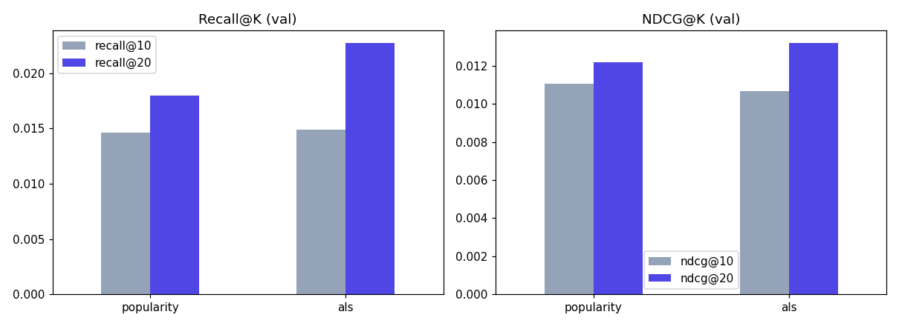

# Building a Modern Recommendation Engine, From Scratch, on Real Data

*A build log: a two-stage recommender (generative retrieval + ranking) grounded in
2023–2026 research, built end to end — data pipeline, models, API, and a live demo — with
every design decision explained, not just the code.*

> Status: draft, in progress. This post is being written alongside the build itself, so
> it includes the false starts, not just the parts that worked on the first try.

---

## Why this project

Most recommender-system portfolio projects are a single collaborative-filtering notebook
on MovieLens. That's fine as an exercise, but it doesn't look like what recommendation
systems actually are at companies running them in production: a multi-stage pipeline
where cheap, wide *retrieval* narrows a huge catalog down to a shortlist, and a more
expensive, precise *ranking* model orders that shortlist.

This project builds that pattern for real, on a real e-commerce dataset, using the same
family of techniques (generative retrieval over "Semantic IDs") that Google DeepMind's
TIGER and Meta's HSTU/"Actions Speak Louder Than Words" papers introduced — not because
it's trendy, but because it's genuinely the direction the field has moved, and building it
first-hand is a much better way to be able to talk about it than reading the papers alone.

## The architecture, at a glance

```
                    ┌──────────────┐        ┌──────────┐
user history  ───▶  │  RETRIEVAL   │ ───▶   │ RANKING  │ ───▶  top-K recommendations
                    │ (cheap, wide) │ 100s   │(precise, │
                    └──────────────┘ candid. │ narrow)  │
                                              └──────────┘
```

- **Baselines** (popularity, ALS matrix factorization) — establish the floor.
- **Retrieval**: item content → RQ-VAE → discrete "Semantic IDs" → a Transformer trained to
  *generate* the next item's Semantic ID from a user's history, autoregressively.
- **Ranking**: a second model reorders retrieval's candidates using features retrieval
  couldn't afford to compute for the whole catalog (price, recency, popularity, content
  similarity).
- Every stage gets measured with Recall@K / NDCG@K against the same held-out data, so the
  post can show *what each added layer of complexity actually bought*, not just assert it.

Full architecture references: TIGER ([arXiv](https://arxiv.org/abs/2305.05065)), HSTU /
generative recommenders ([Meta, GitHub](https://github.com/facebookresearch/generative-recommenders)).

## Picking a dataset was harder than the model

This is worth writing up honestly, because it's a more realistic engineering story than
"I downloaded MovieLens and got 95% accuracy."

**Attempt 1 — Amazon Reviews 2023.** The obvious choice: real e-commerce interactions,
the same dataset family the TIGER-style papers benchmark on. Blocked immediately — the
environment this was first being built in had no network access to Hugging Face, where the
dataset lives.

**Attempt 2 — UCI Online Retail**, as a placeholder to keep the pipeline moving: real
transaction data from a UK gift retailer, ~540K rows, reachable via a GitHub mirror. Good
enough to build and test the whole cleaning → splitting → sequence-building pipeline
against real data while the Amazon path got sorted out.

**Attempt 3 — Amazon Reviews 2023, raw `All_Beauty` category.** Once reachable directly
(downloading straight from the dataset's own file server instead of through a library),
this looked like the win — until the numbers came in: **93.9% of users had exactly one
review, ever.** A sequential recommender needs *history* to predict from. With almost no
repeat users, there's nothing to learn. Not a bug — just what raw review data looks like:
most people review a product once and move on.

**Attempt 4 (final) — Amazon Reviews 2023, "5-core" `Video_Games`.** The dataset's authors
publish a pre-filtered version specifically for recsys benchmarking: every user and item
guaranteed ≥5 interactions, by construction. `Video_Games` was chosen over the default
`All_Beauty` because `All_Beauty` collapses to only 253 users after that filtering — too
small. `Video_Games` gives **94,762 users, 25,612 items, 814,586 interactions** — a real,
commonly-benchmarked category, meaning results here are roughly comparable to published
numbers.

*Blog framing note: this makes a good section because it shows judgment, not just
execution — "here's the number that told me to change course," three times, is more
convincing than a project where every choice was right the first time.*

## Splitting data the way production systems actually need to

A random train/test split lets a model train on a 2022 interaction and get evaluated on
one from 2005 — it's effectively seen the future. Every real recommender predicts
*forward* in time from what it currently knows, so evaluation has to mirror that.

The split here is **time-based**, and — a small engineering detail worth mentioning —
computed as a *percentage of the dataset's own timespan* rather than hardcoded dates, so
the same script produces a sensible split whether the data spans one year (UCI) or
twenty-four (Amazon). Last 8% of the time range → test, the 8% before that → val, everything
earlier → train.

| Split | Rows | Users |
|---|---|---|
| Train | 645,982 | 85,757 |
| Val | 96,009 | 32,852 |
| Test | 72,595 | 22,722 |

And a number that matters a lot for the rest of the architecture: **18–28% of val/test
users are "cold-start"** — never seen in training at all. A pure collaborative-filtering
model has *zero* signal for them; it can only fall back to popularity. That gap is the
direct, measured justification for the content-based Semantic ID retrieval stage later in
this series — it's not a nice-to-have, it's fixing a specific, quantified failure mode.

## Baselines: earning the right to add complexity

Before anything sophisticated, two simple models, to establish the floor:

**Popularity** — recommend whatever's most-interacted-with, same list for everyone. Sounds
too dumb to bother with, but with a median of 6 interactions per user, it's a genuinely
strong baseline in practice.

**ALS (matrix factorization)** — represent every user and item as a short vector such that
`dot(user_vector, item_vector)` ≈ affinity. The vectors aren't hand-designed; they're
learned purely from interaction patterns. The "alternating" in ALS is the trick that makes
training tractable: solving for all users *and* items simultaneously is hard and
non-convex, but freezing one side and solving the other is plain least squares — so the
algorithm alternates, freeze-solve-swap, until it converges.

One implementation detail worth a paragraph in the technical write-up: this data is
*implicit feedback* — we only observe positive interactions, never a true "dislikes this."
The standard fix (Hu, Koren & Volinsky, 2008) is confidence weighting: treat every observed
interaction as a positive with confidence proportional to interaction strength, rather than
treating every unobserved pair as a certain negative.

| split | model | recall@10 | recall@20 | ndcg@10 | ndcg@20 |
|---|---|---|---|---|---|
| val | popularity | 0.0146 | 0.0180 | 0.0111 | 0.0122 |
| val | als | 0.0149 | 0.0227 | 0.0107 | 0.0132 |
| test | popularity | 0.0058 | 0.0071 | 0.0038 | 0.0042 |
| test | als | 0.0051 | 0.0078 | 0.0036 | 0.0044 |



**ALS doesn't cleanly win.** It's ahead on recall@20 in both splits, roughly tied on
recall@10, and actually a little behind popularity on test recall@10 and both ndcg@10
numbers. That's not a bug — it's a real, honest result, and it comes down to two things
already measured above: a median of 6 interactions per user gives ALS very little signal to
personalize with, and 18–28% of val/test users are cold-start, where ALS has no learned
vector at all and just falls back to popularity anyway. So a chunk of "ALS's" score here is
really popularity's score in disguise.

That gap is exactly the motivation for the next step: Semantic IDs and generative retrieval
are built specifically to still say something useful about sparse and cold-start
users — which is precisely where this baseline comparison shows plain collaborative
filtering running out of signal.

## What's next

Retrieval via Semantic IDs (RQ-VAE + a generative Transformer) — the part of this project
most directly lifted from 2023–2026 research, and the part that actually fixes the
cold-start gap measured above.

---

*Sources referenced in this section: [TIGER paper](https://arxiv.org/abs/2305.05065),
[Meta generative-recommenders / HSTU](https://github.com/facebookresearch/generative-recommenders),
[Hu, Koren & Volinsky 2008](https://www.semanticscholar.org/paper/Collaborative-Filtering-for-Implicit-Feedback-Hu-Koren/184b7281a87ee16228b24716ca02b29519d52eb5),
[implicit library](https://github.com/benfred/implicit).*
